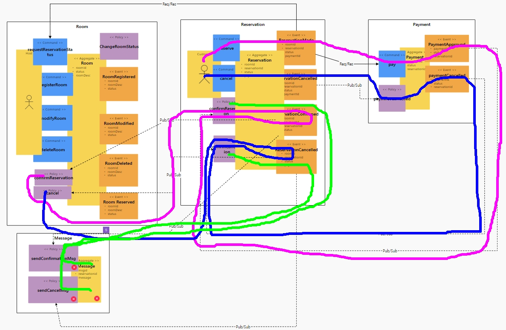

# H-Booking
에어비앤비 따라잡기
-----


# 평가항목
1. Saga
2. CQRS(Command and Query Responsitibility and Segregation)
3. Correlation/Compensation(반드시 구현)
4. Req / Resp
5. Gateway(단일진입점)
6. Deploy / Pipeline
7. Circuit Breaker
8. Autoscale (HPA)
9. Zero-downtime deploy (readiness probe)
10. ConfigMap/Persistence Volume
11. Polyglot
12. Self-healing (liveness probe)
   
----
# Saga
+ Pub/Sub연결


+ 완성본 대한 기능 검증


```
  - 기능요소
    - 호스트가 제공할 숙소를 등록/수정/삭제한다 (ok)
    - 고객이 숙소를 선택하여 예약을 요청한다 (ok)
    - 예약 요청 직후 결제가 진행된다 (ok)
    - 사용자가 결제한다 (ok)
    - 결제가 완료되면 호스트에게 예약 요청 정보가 전달된다 (ok)
    - 호스트가 예약을 확정하면 고객에게 예약내역이 전달된다 (ok)
    - 고객이 예약을 취소할 수 있다 (ok)
    - 숙박예약이 취소될 경우 취소 내역이 전달된다 (ok)
    - 숙소에 대한 정보 및 예약 상태 등을 한 화면에서 확인할 수 있다 (ok)
  - 비기능요소
    - 마이크로 서비스를 넘나드는 시나리오에 대한 트랜잭션 처리
    - 고객 결제가 완료 되지 않은 예약 요청은 'ACID' 트랜잭션 적용(Request/Response 방식 처리)
    - 장애 격리
      - 숙소 등록/수정 기능, 예약 내역 메시지 전송 기능과 별도로 예약은 24시간 처리 가능(Async, Eventual Consistency)
      - 예약시스템이 과중되면 예약을 잠시 받지 않고 잠시 후에 하도록 유도(Circuit breaker, fallback)
  
  ```
  
+ 구현<p>
   서비스를 Local에서 아래와 같은 방법으로 서비스별로 개별적으로 실행한다.
   
```
    cd room
    mvn spring-boot:run
```
```
    cd reservation
    mvn spring-boot:run 
```
```
    cd payment
    mvn spring-boot:run  
```
```
    cd message
    python policy-handler.py 
```

+ DDD적용<p>
    4개의 도메인으로 관리되고 있으며 `숙소(Room)`, `결제(Payment)`, `예약(Reservation)`, `메시지(Message)`으로 구성된다.
 
```
   
   @Table(name="Reservation_table")
   public class Reservation  {

       @Id
       @GeneratedValue(strategy=GenerationType.AUTO)
       private Long roomId;

       private Long reservationId;

       private Integer status;

       private Long paymentId;


       @PostPersist
       public void onPostPersist(){
           //숙소 예약 요청
         ReservationMade reservationMade = new ReservationMade();
           BeanUtils.copyProperties(this, reservationMade);
           reservationMade.publishAfterCommit();

           hbooking.external.Room room = new hbooking.external.Room();
           room.setRoomId(getid());

           ReservationApplication.applicationContext.getBean(hbooking.external.RoomService.class)
               .requestReservationStatus(room);

           ReservationCancelled reservationCancelled = new ReservationCancelled();
           BeanUtils.copyProperties(this, reservationCancelled);
           reservationCancelled.publishAfterCommit();

           ReservationConfirmed reservationConfirmed = new ReservationConfirmed();
           BeanUtils.copyProperties(this, reservationConfirmed);
           reservationConfirmed.publishAfterCommit();

           ReservationCancelled reservationCancelled = new ReservationCancelled();
           BeanUtils.copyProperties(this, reservationCancelled);
           reservationCancelled.publishAfterCommit();

    }
```

+ 서비스 호출흐름(Sync)<p>
   `숙소요청(Reservation)` -> `결제(Payment)`간 호출은 동기식으로 일관성을 유지하는 트랜잭션으로 처리
   * 고객이 숙소 예약 요청
   * 결제서비스를 호출하기 위해 FeignClient 이용하여 Proxy 구현
   * 예약 요청을 받은 직후 `(@PostPersist`) 결제를 요청하도록 처리

```
      package hbooking.external;

      import org.springframework.cloud.openfeign.FeignClient;
      import org.springframework.web.bind.annotation.RequestBody;
      import org.springframework.web.bind.annotation.PathVariable;
      import org.springframework.web.bind.annotation.RequestMapping;
      import org.springframework.web.bind.annotation.RequestMethod;

      import java.util.Date;

      @FeignClient(name="Payment", url="http://Payment:8080")
      public interface PaymentService {
          @RequestMapping(method= RequestMethod.GET, path="/payments")
          public void pay(@RequestBody Payment payment);

      }

```
   
# CQRS(Command and Query Responsitibility and Segregation)

숙소 예약 가능 여부/결제 등 현 Status에 대해 고객이 조회할 수 있도록 CQRS로 구현
+ room, reservation, payment 개별 Aggregate Status 데이터 통합 조회하여 성능 이슈 사전 예방
+ 뷰를 위한 테이블 모델링(RoomView)<p>


+ reservation 서비스(8081)와 room 서비스(8082)를 각각 실행 
   
   
```
    cd room
    mvn spring-boot:run
```
```
    cd reservation
    mvn spring-boot:run 
```

+ room에 대한 reservation요청
   
 ```sql
 http localhost:8081/reservations roomId=203 
 ```
   
 ```sql
HTTP/1.1 201
Content-Type: application/json;charset=UTF-8
Date: Fri, 08 Apr 2022 11:48:23 GMT
Location: http://localhost:8081/reservations/1
Transfer-Encoding: chunked

{
    "_links": {
        "reservation": {
            "href": "http://localhost:8081/reservations/1"
        },
        "self": {
            "href": "http://localhost:8081/reservations/1"
        }
    },
    "roomId": 203,
}
```
   

+ 카프카 customer 이벤트 모니터링

```
/usr/local/kafka/bin/kafka-console-customer.sh --bootstrap-server localhost:9092 --topic booking --from-beginning
```

```sql
{"eventType":"Reserved","timestamp":"20220408114823","id":1,"roomId":203,"me":true}
{"eventType":"Allocated","timestamp":"20220408114823","id":1,"resrvationId":1,"taxiId":1,"me":true}
```

+ roomView 서비스를 실행
+ roomView 에서 room, resrvation,pament 상태 통합 조회 가능

```
cd grabView
mvn spring-boot:run
```
   
```
"roomViews": [
   {
    "_links": {
        "roomview": {
            "href": "http://localhost:8085/roomViews/1"
        },
        "self": {
            "href": "http://localhost:8085/roomViews/1"
        }
    },
    "roomdesc": "house with wonderful view",
    "status" : 1,
    "reservationId" : 1,
    "paymentId" :1
  },
   
```

   
 
# Correlation / Compensation
## Correlation Id

+ Correlation Id를 생성하는 로직은 common-module로 구성하였다. 해당 로직은, 모든 컴포넌트에 동일하게 적용하고 컴포넌트 간의 통신은 Json 기반의 Http request를 받았을 때, Filter 에서 생성
+ 예약을 하면 동시에 예약한 방(Room), 결제(Payment) 서비스 상태가 변경
+ 예약 취소시에도 동일하게 예약 취소한 방(Room), 결제(Payment) 서비스 상태 변경
   
```diff
@Slf4j
public class CorrelationIdFilter extends OncePerRequestFilter {

    @Override
    protected void doFilterInternal(HttpServletRequest request, HttpServletResponse response, FilterChain filterChain)
            throws ServletException, IOException {
        CorrelationHttpHeaderHelper.prepareCorrelationParams(request);
        CorrelationLoggerUtil.updateCorrelation();
        filterChain.doFilter(request, response);
        CorrelationLoggerUtil.clear();
    }
 }
```

   
+ Filter에서는, 요청받은 request 를 확인하여, Correlation-Id가 존재할 경우, 해당 데이터를 식별자로 사용하고, 존재하지 않을 경우에는, 신규 Correlation Id를 생성한다. 관련 로직은 다음과 같다.
```diff
@Slf4j
public class CorrelationHttpHeaderHelper {

    public static void prepareCorrelationParams(HttpServletRequest httpServletRequest) {
        String currentCorrelationId = prepareCorrelationId(httpServletRequest);
       setCorrelations(httpServletRequest, currentCorrelationId);
        log.debug("Request Correlation Parameters : ");
        CorrelationHeaderField[] headerFields = CorrelationHeaderField.values();
        for (CorrelationHeaderField field : headerFields) {
            String value = CorrelationHeaderUtil.get(field);
            log.debug("{} : {}", field.getValue(), value);
        }
    }

    private static String prepareCorrelationId(HttpServletRequest httpServletRequest) {
        String currentCorrelationId = httpServletRequest.getHeader(CorrelationHeaderField.CORRELATION_ID.getValue());
        if (currentCorrelationId == null) {
            currentCorrelationId = CorrelationContext.generateId();
            log.trace("Generated Correlation Id: {}", currentCorrelationId);
        } else {
            log.trace("Incoming Correlation Id: {}", currentCorrelationId);
        }
        return currentCorrelationId;
    }
} 
```
   
   

## Compensation

+ `Correlation Id` 정보를 기반으로 kafka를 이용한 비동기방식의 Compensation Transaction 처리
```diff
package com.example.kafkapub.publish;

import ...

@Component
 public class GreetingProducer {
    @Autowired
    private KafkaTemplate<String, Greeting> greetingKafkaTemplate;

    @Value(value = "${greeting.topic.name}")
    private String greetingTopicName;

    public void sendMessage(Greeting greeting) {
        ListenableFuture<SendResult<String, Greeting>> future = greetingKafkaTemplate.send(greetingTopicName, greeting);

        future.addCallback(new ListenableFutureCallback<SendResult<String, Greeting>>() {
            @Override
            public void onSuccess(SendResult<String, Greeting> result) {
                Greeting g = result.getProducerRecord().value();
                System.out.println("Sent message=[" + g.toString() + "] with offset=[" + result.getRecordMetadata().offset() + "]");
            }

            @Override
            public void onFailure(Throwable ex) {
                // needed to do compensation transaction.
                System.out.println( "Unable to send message=[" + greeting.toString() + "] due to : " + ex.getMessage());
            }
        });
    }
}
```

```diff
package com.example.kafkasub.consume;

import ...

@Component
  public class GreetingConsumer {

    @KafkaListener(topics = "${greeting.topic.name}", containerFactory = "greetingKafkaListenerContainerFactory")
     public void greetingListener(Greeting greeting, Acknowledgment ack) {
        try {
            System.out.println("----Received Message----");
            System.out.println("id: " + greeting.getName());
            System.out.println("act: " + greeting.getMsg());

            ack.acknowledge();
        } catch (Exception e) {
            // 에러 처리
        }
    }
}

```
   

# Req / Resp (feign client)

* `Interface 선언`을 통해 자동으로 Http Client 생성
* 선언적 Http Client란, Annotation만으로 Http Client를 만들수 있고, 이를 통해서 원격의 Http API호출이 가능
 
+ Dependency 추가
```diff
dependencies {
    ...
    
    /** feign client*/
    implementation 'org.springframework.cloud:spring-cloud-starter-openfeign'
    implementation group: 'io.github.openfeign', name: 'feign-gson', version: '11.0'

    /** spring web*/
    implementation 'org.springframework.boot:spring-boot-starter-web'
    implementation 'junit:junit:4.13.1'
    compileOnly 'org.projectlombok:lombok'
    annotationProcessor 'org.springframework.boot:spring-boot-configuration-processor'
    annotationProcessor 'org.projectlombok:lombok'
    
    ...
}
```

+ Controller
```diff
package com.example.feigntest.controller;

import ...

@Slf4j
@RestController
@RequiredArgsConstructor
public class HTaxiFeignController {

    private final HTaxiFeignService HTaxiFeignService;

   @GetMapping(value = "/v1/github/{owner}/{repo}")
    public List<Contributor> getHTaxiContributors(@PathVariable String owner , @PathVariable String repo){
        return HTaxiFeignService.getContributor(owner,repo);
    }
}

```

+ Service
```diff
package com.example.feigntest.service;

import ...

@Slf4j
@Service
public class HTaxiFeignService {

  @Autowired
  private HTaxiFeignClient hTaxiFeignClient;

  public List<Contributor> getContributor(String owner, String repo) {
    List<Contributor> contributors = hTaxiFeignClient.getContributor(owner, repo);
    return contributors;
  }
}

```

+ FeignClient Interface
```diff
package com.example.feigntest.client;

import ...

@FeignClient(name="feign", url="https://api.github.com/repos",configuration = Config.class)
public interface HTaxiFeignClient {
    @RequestMapping(method = RequestMethod.GET , value = "/{owner}/{repo}/contributors")
    List<Contributor> getContributor(@PathVariable("owner") String owner, @PathVariable("repo") String repo);
}


```

+ DTO
```
package com.example.feigntest.dto;

import lombok.Data;

@Data
public class Contributor {
    String login;
    String id;
    String type;
    String site_admin;
}	
```
	
	
+ `@EnableFeignClients` Set
```diff
package com.example;

import ...
@EnableFeignClients
@SpringBootApplication
public class ApiTestApplication {

    public static void main(String[] args) {
        SpringApplication.run(ApiTestApplication.class, args);
    }

}

```
   
## Gateway
+ gateway App 추가 후 application.yaml 에서 각 서비스 routes 추가하고 gateway 서버 포트를 8080로 설정

```
   spring:
  profiles: docker
  cloud:
    gateway:
      routes:
        - id: payment
          uri: http://payment:8080
          predicates:
            - Path=/payments/** 
        - id: room
          uri: http://room:8080
          predicates:
            - Path=/rooms/**, /check/**
        - id: reservation
          uri: http://reservation:8080
          predicates:
            - Path=/reservations/**
        - id: message
          uri: http://message:8080
          predicates:
            - Path=/messages/** 
        - id: viewpage
          uri: http://viewpage:8080
          predicates:
            - Path= /roomviews/**
      globalcors:
        corsConfigurations:
          '[/**]':
            allowedOrigins:
              - "*"
            allowedMethods:
              - "*"
            allowedHeaders:
              - "*"
            allowCredentials: true

server:
  port: 8080  
```
   
# Deploy
